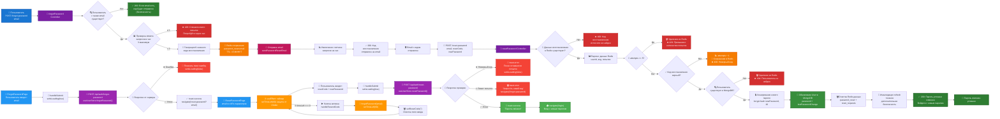

```mermaid
flowchart LR
    %% БЭКЕНД - ЭТАП 1: Запрос восстановления пароля
    A["👤 Пользователь<br/>POST /forgot-password<br/>email"] --> B["📝 forgotPassword Controller"]
    B --> C{"🔍 Пользователь<br/>с таким email<br/>существует?"}
    C -->|Нет| D["✅ 200: Если email есть,<br/>код будет отправлен<br/>(безопасность)"]
    C -->|Да| E{"📊 Проверка лимита<br/>запросов в час<br/>3 максимум"}
    E -->|≥ 3| F["❌ 429: Слишком много попыток<br/>Попробуйте через час"]
    E -->|< 3| G["🔢 Генерация 6-значного<br/>кода восстановления"]
    G --> H["💾 Redis сохранение<br/>password_reset:email<br/>TTL: 15 МИНУТ"]
    H --> I["📧 Отправка email<br/>sendPasswordResetEmail"]
    I --> J["📈 Увеличение счетчика<br/>запросов на час"]
    J --> K["✅ 200: Код восстановления<br/>отправлен на email"]
    K --> L["⏳ Email с кодом отправлен"]
    
    %% БЭКЕНД - ЭТАП 2: Сброс пароля
    L --> M["👤 POST /reset-password<br/>email, resetCode, newPassword"]
    M --> N["📝 resetPassword Controller"]
    N --> O{"💾 Данные восстановления<br/>в Redis существуют?"}
    O -->|Нет| P["❌ 400: Код восстановления<br/>истек или не найден"]
    O -->|Да| Q["📊 Парсинг данных Redis<br/>userId, код, попытки"]
    Q --> R{"🔢 attempts >= 5?"}
    R -->|Да| S["🗑️ Удаление из Redis<br/>❌ 429: Превышено<br/>количество попыток"]
    R -->|Нет| T{"✅ Код восстановления верный?"}
    T -->|Нет| U["📈 attempts + 1<br/>💾 Сохранение в Redis<br/>❌ 400: Неверный код"]
    T -->|Да| V{"🔍 Пользователь<br/>существует в MongoDB?"}
    V -->|Нет| W["🗑️ Удаление из Redis<br/>❌ 404: Пользователь не найден"]
    V -->|Да| X["🔒 Хеширование нового пароля<br/>bcrypt.hash newPassword, 10"]
    X --> Y["👤 Обновление User в MongoDB<br/>password + lastPasswordChange"]
    Y --> Z["🗑️ Очистка Redis данных<br/>password_reset + reset_requests"]
    Z --> AA["🔐 Инвалидация refresh токенов<br/>дополнительная безопасность"]
    AA --> BB["✅ 200: Пароль успешно изменен<br/>Войдите с новым паролем"]
    BB --> CC["🎉 Пароль изменен успешно"]

    %% ФРОНТЕНД - ЭТАП 1: Страница запроса восстановления
    FE_A["📱 ForgotPasswordPage<br/>Пользователь вводит:<br/>email"] --> FE_B["🔄 handleSubmit<br/>setIsLoading(true)"]
    FE_B --> FE_C["📡 POST /api/auth/forgot-password<br/>useUserStore.forgotPassword()"]
    FE_C --> FE_D{"🤔 Response от сервера"}
    FE_D -->|❌ Ошибка| FE_E["🚨 Показать toast ошибку<br/>setIsLoading(false)"]
    FE_D -->|✅ Успех| FE_F["✅ toast.success<br/>navigate(/reset-password?email)"]
    
    %% ФРОНТЕНД - ЭТАП 2: Страница сброса пароля
    FE_F --> FE_G["🔐 ResetPasswordPage<br/>email из URL параметров"]
    FE_G --> FE_H["⏰ useEffect: таймер<br/>setTimeLeft(60) защита от спама"]
    FE_H --> FE_I["👤 Пользователь вводит:<br/>resetCode + newPassword"]
    FE_I --> FE_J["🔄 handleSubmit<br/>setIsLoading(true)"]
    FE_J --> FE_K["📡 POST /api/auth/reset-password<br/>useUserStore.resetPassword()"]
    FE_K --> FE_L{"🤔 Response проверки"}
    
    %% ФРОНТЕНД - Ветка неверного кода
    FE_L -->|❌ Неверный код| FE_M["🚨 toast.error<br/>Показ оставшихся попыток<br/>setIsLoading(false)"]
    
    %% ФРОНТЕНД - Ветка лимита попыток
    FE_L -->|🔥 Лимит попыток| FE_N["🗑️ toast.error<br/>'Запросіть новий код'<br/>navigate(/forgot-password)"]
    
    %% ФРОНТЕНД - Ветка успешного сброса
    FE_L -->|✅ Успех| FE_O["🎉 toast.success<br/>'Пароль змінено!'"]
    FE_O --> FE_P["🏠 navigate(/login)<br/>Вход с новым паролем"]
    
    %% ФРОНТЕНД - Повторная отправка кода
    FE_H -->|⏰ timeLeft === 0| FE_Q["▶️ Кнопка активна<br/>handleResendCode"]
    FE_Q --> FE_R["🔄 forgotPassword(email)<br/>setTimeLeft(60)"]
    FE_R --> FE_S["🗑️ setResetCode('')<br/>Очистка поля ввода"]
    FE_S --> FE_H

    %% СТИЛИ БЭКЕНД
    style A fill:#1976d2,color:#fff,stroke:#0d47a1,stroke-width:2px
    style B fill:#7b1fa2,color:#fff,stroke:#4a148c,stroke-width:2px
    style N fill:#7b1fa2,color:#fff,stroke:#4a148c,stroke-width:2px
    style Y fill:#388e3c,color:#fff,stroke:#1b5e20,stroke-width:2px
    style H fill:#f57c00,color:#fff,stroke:#e65100,stroke-width:2px
    style I fill:#c2185b,color:#fff,stroke:#880e4f,stroke-width:2px
    style BB fill:#2e7d32,color:#fff,stroke:#1b5e20,stroke-width:3px
    style CC fill:#2e7d32,color:#fff,stroke:#1b5e20,stroke-width:3px
    style D fill:#2e7d32,color:#fff,stroke:#1b5e20,stroke-width:2px
    style F fill:#d32f2f,color:#fff,stroke:#b71c1c,stroke-width:2px
    style P fill:#d32f2f,color:#fff,stroke:#b71c1c,stroke-width:2px
    style S fill:#d32f2f,color:#fff,stroke:#b71c1c,stroke-width:2px
    style U fill:#f57c00,color:#fff,stroke:#e65100,stroke-width:2px
    style W fill:#d32f2f,color:#fff,stroke:#b71c1c,stroke-width:2px
    
    %% СТИЛИ ФРОНТЕНД
    style FE_A fill:#2196f3,color:#fff,stroke:#1976d2,stroke-width:2px
    style FE_G fill:#2196f3,color:#fff,stroke:#1976d2,stroke-width:2px
    style FE_H fill:#ff9800,color:#fff,stroke:#f57c00,stroke-width:2px
    style FE_R fill:#ff9800,color:#fff,stroke:#f57c00,stroke-width:2px
    style FE_O fill:#4caf50,color:#fff,stroke:#388e3c,stroke-width:3px
    style FE_P fill:#4caf50,color:#fff,stroke:#388e3c,stroke-width:3px
    style FE_E fill:#f44336,color:#fff,stroke:#d32f2f,stroke-width:2px
    style FE_M fill:#f44336,color:#fff,stroke:#d32f2f,stroke-width:2px
    style FE_N fill:#f44336,color:#fff,stroke:#d32f2f,stroke-width:2px
    style FE_C fill:#9c27b0,color:#fff,stroke:#7b1fa2,stroke-width:2px
    style FE_K fill:#9c27b0,color:#fff,stroke:#7b1fa2,stroke-width:2px
```