+# Процесс восстановления и сброса пароля

## Упрощенная схема восстановления пароля

**Логика**: 15 минут на ввод кода, 5 попыток, защита от спама (3 запроса/час)

## Mermaid диаграмма:

```mermaid
flowchart LR
    %% БЭКЕНД - ЭТАП 1: Запрос восстановления пароля
    A["👤 Пользователь<br/>POST /forgot-password<br/>email"] --> B["📝 forgotPassword Controller"]
    B --> C{"🔍 Пользователь<br/>с таким email<br/>существует?"}
    C -->|Нет| D["✅ 200: Если email есть,<br/>код будет отправлен<br/>(безопасность)"]
    C -->|Да| E{"📊 Проверка лимита<br/>запросов в час<br/>3 максимум"}
    E -->|≥ 3| F["❌ 429: Слишком много попыток<br/>Попробуйте через час"]
    E -->|< 3| G["🔢 Генерация 6-значного<br/>кода восстановления"]
    G --> H["💾 Redis сохранение<br/>password_reset:email<br/>TTL: 15 МИНУТ"]
    H --> I["📧 Отправка email<br/>sendPasswordResetEmail"]
    I --> J["📈 Увеличение счетчика<br/>запросов на час"]
    J --> K["✅ 200: Код восстановления<br/>отправлен на email"]
    K --> L["⏳ Email с кодом отправлен"]
    
    %% БЭКЕНД - ЭТАП 2: Сброс пароля
    L --> M["👤 POST /reset-password<br/>email, resetCode, newPassword"]
    M --> N["📝 resetPassword Controller"]
    N --> O{"💾 Данные восстановления<br/>в Redis существуют?"}
    O -->|Нет| P["❌ 400: Код восстановления<br/>истек или не найден"]
    O -->|Да| Q["📊 Парсинг данных Redis<br/>userId, код, попытки"]
    Q --> R{"🔢 attempts >= 5?"}
    R -->|Да| S["🗑️ Удаление из Redis<br/>❌ 429: Превышено<br/>количество попыток"]
    R -->|Нет| T{"✅ Код восстановления верный?"}
    T -->|Нет| U["📈 attempts + 1<br/>💾 Сохранение в Redis<br/>❌ 400: Неверный код"]
    T -->|Да| V{"🔍 Пользователь<br/>существует в MongoDB?"}
    V -->|Нет| W["🗑️ Удаление из Redis<br/>❌ 404: Пользователь не найден"]
    V -->|Да| X["🔒 Хеширование нового пароля<br/>bcrypt.hash newPassword, 10"]
    X --> Y["👤 Обновление User в MongoDB<br/>password + lastPasswordChange"]
    Y --> Z["🗑️ Очистка Redis данных<br/>password_reset + reset_requests"]
    Z --> AA["🔐 Инвалидация refresh токенов<br/>дополнительная безопасность"]
    AA --> BB["✅ 200: Пароль успешно изменен<br/>Войдите с новым паролем"]
    BB --> CC["🎉 Пароль изменен успешно"]

    %% ФРОНТЕНД - ЭТАП 1: Страница запроса восстановления
    FE_A["📱 ForgotPasswordPage<br/>Пользователь вводит:<br/>email"] --> FE_B["🔄 handleSubmit<br/>setIsLoading(true)"]
    FE_B --> FE_C["📡 POST /api/auth/forgot-password<br/>useUserStore.forgotPassword()"]
    FE_C --> FE_D{"🤔 Response от сервера"}
    FE_D -->|❌ Ошибка| FE_E["🚨 Показать toast ошибку<br/>setIsLoading(false)"]
    FE_D -->|✅ Успех| FE_F["✅ toast.success<br/>navigate(/reset-password?email)"]
    
    %% ФРОНТЕНД - ЭТАП 2: Страница сброса пароля
    FE_F --> FE_G["🔐 ResetPasswordPage<br/>email из URL параметров"]
    FE_G --> FE_H["⏰ useEffect: таймер<br/>setTimeLeft(60) защита от спама"]
    FE_H --> FE_I["👤 Пользователь вводит:<br/>resetCode + newPassword"]
    FE_I --> FE_J["🔄 handleSubmit<br/>setIsLoading(true)"]
    FE_J --> FE_K["📡 POST /api/auth/reset-password<br/>useUserStore.resetPassword()"]
    FE_K --> FE_L{"🤔 Response проверки"}
    
    %% ФРОНТЕНД - Ветка неверного кода
    FE_L -->|❌ Неверный код| FE_M["🚨 toast.error<br/>Показ оставшихся попыток<br/>setIsLoading(false)"]
    
    %% ФРОНТЕНД - Ветка лимита попыток
    FE_L -->|🔥 Лимит попыток| FE_N["🗑️ toast.error<br/>'Запросіть новий код'<br/>navigate(/forgot-password)"]
    
    %% ФРОНТЕНД - Ветка успешного сброса
    FE_L -->|✅ Успех| FE_O["🎉 toast.success<br/>'Пароль змінено!'"]
    FE_O --> FE_P["🏠 navigate(/login)<br/>Вход с новым паролем"]
    
    %% ФРОНТЕНД - Повторная отправка кода
    FE_H -->|⏰ timeLeft === 0| FE_Q["▶️ Кнопка активна<br/>handleResendCode"]
    FE_Q --> FE_R["🔄 forgotPassword(email)<br/>setTimeLeft(60)"]
    FE_R --> FE_S["🗑️ setResetCode('')<br/>Очистка поля ввода"]
    FE_S --> FE_H

    %% СТИЛИ БЭКЕНД
    style A fill:#1976d2,color:#fff,stroke:#0d47a1,stroke-width:2px
    style B fill:#7b1fa2,color:#fff,stroke:#4a148c,stroke-width:2px
    style N fill:#7b1fa2,color:#fff,stroke:#4a148c,stroke-width:2px
    style Y fill:#388e3c,color:#fff,stroke:#1b5e20,stroke-width:2px
    style H fill:#f57c00,color:#fff,stroke:#e65100,stroke-width:2px
    style I fill:#c2185b,color:#fff,stroke:#880e4f,stroke-width:2px
    style BB fill:#2e7d32,color:#fff,stroke:#1b5e20,stroke-width:3px
    style CC fill:#2e7d32,color:#fff,stroke:#1b5e20,stroke-width:3px
    style D fill:#2e7d32,color:#fff,stroke:#1b5e20,stroke-width:2px
    style F fill:#d32f2f,color:#fff,stroke:#b71c1c,stroke-width:2px
    style P fill:#d32f2f,color:#fff,stroke:#b71c1c,stroke-width:2px
    style S fill:#d32f2f,color:#fff,stroke:#b71c1c,stroke-width:2px
    style U fill:#f57c00,color:#fff,stroke:#e65100,stroke-width:2px
    style W fill:#d32f2f,color:#fff,stroke:#b71c1c,stroke-width:2px
    
    %% СТИЛИ ФРОНТЕНД
    style FE_A fill:#2196f3,color:#fff,stroke:#1976d2,stroke-width:2px
    style FE_G fill:#2196f3,color:#fff,stroke:#1976d2,stroke-width:2px
    style FE_H fill:#ff9800,color:#fff,stroke:#f57c00,stroke-width:2px
    style FE_R fill:#ff9800,color:#fff,stroke:#f57c00,stroke-width:2px
    style FE_O fill:#4caf50,color:#fff,stroke:#388e3c,stroke-width:3px
    style FE_P fill:#4caf50,color:#fff,stroke:#388e3c,stroke-width:3px
    style FE_E fill:#f44336,color:#fff,stroke:#d32f2f,stroke-width:2px
    style FE_M fill:#f44336,color:#fff,stroke:#d32f2f,stroke-width:2px
    style FE_N fill:#f44336,color:#fff,stroke:#d32f2f,stroke-width:2px
    style FE_C fill:#9c27b0,color:#fff,stroke:#7b1fa2,stroke-width:2px
    style FE_K fill:#9c27b0,color:#fff,stroke:#7b1fa2,stroke-width:2px
```



## Текстовое описание Frontend процесса:

### 📱 ЭТАП 1: ForgotPasswordPage - Запрос восстановления

1. **Ввод email**: пользователь вводит email адрес
2. **Валидация на клиенте**: проверка формата email
3. **handleSubmit**: отправка данных через `useUserStore.forgotPassword()`
4. **setLoading(true)**: показ индикатора загрузки
5. **API вызов**: `POST /api/auth/forgot-password` с email
6. **Обработка ответа**:
   - **Ошибка**: показ toast ошибки + `setLoading(false)`
   - **Успех**: toast успеха + переход на `/reset-password?email=${email}`

### 🔐 ЭТАП 2: ResetPasswordPage - Сброс пароля

1. **Получение email**: из URL параметров
2. **Запуск таймера**: `useEffect` устанавливает `setTimeLeft(60)` - защита от спама
3. **Ввод данных**: пользователь вводит 6-значный код + новый пароль
4. **Валидация пароля**: проверка требований к паролю на клиенте
5. **handleSubmit сброса пароля**:
   - `setLoading(true)`
   - API вызов `POST /api/auth/reset-password`
6. **Обработка ответов**:

#### Сценарий: ❌ Неверный код (есть попытки)
- Показ toast с количеством оставшихся попыток
- Пользователь может снова попробовать ввести код

#### Сценарий: 🔥 Лимит попыток исчерпан  
- Показ toast "Запросите новый код"
- Автоперенаправление на `/forgot-password`
- Пользователь должен заново запросить код

#### Сценарий: ⏰ Таймер истек (60 секунд защиты)
- Кнопка "Повторно отправить код" становится активной
- handleResendCode → вызов forgotPassword + сброс таймера
- Очистка поля ввода кода

#### Сценарий: ✅ Успешный сброс пароля
- Toast успеха "Пароль изменен!"  
- **Автоперенаправление**: `navigate('/login')`
- Пользователь может войти с новым паролем

### 🔄 Ключевые Frontend особенности:

- **Таймер защиты от спама**: 60 секунд между повторными запросами
- **Передача email**: через URL параметры между страницами  
- **Toast уведомления**: для всех результатов операций
- **Автоматические переходы**: между этапами процесса
- **Валидация пароля**: требования отображаются в реальном времени
- **Очистка полей**: при повторной отправке кода

## Текстовое описание Backend процесса:

### 🚀 ЭТАП 1: Запрос восстановления пароля (POST /api/auth/forgot-password)

1. **Получение email**: от пользователя  
2. **Проверка существования**: поиск пользователя с таким email в MongoDB
3. **Безопасный ответ**: даже если email не найден, возвращаем SUCCESS (защита от перебора)
4. **Проверка лимита**: максимум 3 запроса в час с одного email  
5. **Генерация кода**: создание 6-значного числового кода восстановления
6. **Сохранение в Redis**: данные восстановления на **15 МИНУТ**
7. **Отправка email**: код восстановления через Gmail SMTP
8. **Увеличение счетчика**: запросов в час для защиты от спама
9. **Ответ**: "Код отправлен на email"

### 🔐 ЭТАП 2: Сброс пароля (POST /api/auth/reset-password)

1. **Валидация данных**: email, resetCode, newPassword обязательны
2. **Проверка минимальной длины**: newPassword >= 6 символов
3. **Проверка сессии**: поиск данных восстановления в Redis по email  
4. **Проверка попыток**: не превышен ли лимит попыток (5 максимум)
5. **Сравнение кода**: введенный vs сохраненный в Redis
6. **При неверном коде**:
   - Увеличиваем счетчик попыток
   - **Сохраняем обновленные данные** с увеличенным счетчиком
   - Возвращаем количество оставшихся попыток
7. **При превышении попыток**: удаляем данные из Redis
8. **При успехе**: 
   - Проверяем существование пользователя в MongoDB
   - Хешируем новый пароль (bcrypt, 10 rounds)  
   - Обновляем пароль + lastPasswordChange в MongoDB
   - Очищаем Redis: password_reset + reset_requests
   - Инвалидируем все refresh токены (безопасность)
9. **Ответ**: "Пароль успешно изменен"

## Структуры данных в Redis:

### password_reset:${email}
```json
{
  "key": "password_reset:user@example.com",
  "value": {
    "email": "user@example.com",
    "resetCode": "123456", 
    "userId": "507f1f77bcf86cd799439011",
    "attempts": 0
  },
  "ttl": 900
}
```

### reset_requests:${email} 
```json
{
  "key": "reset_requests:user@example.com", 
  "value": 2,
  "ttl": 3600
}
```

## Ключевые особенности системы восстановления:

✅ **Безопасность**:
- **15 минут TTL** для кодов восстановления
- **5 попыток** ввода кода максимум  
- **3 запроса в час** максимум на email
- **Лимит по времени**: защита от спама
- **Инвалидация токенов** при смене пароля
- **Скрытие информации**: не раскрываем существование email

✅ **UX особенности**: 
- **Безопасные ответы** - всегда "код отправлен"
- **Повторная отправка кода** с таймером защиты
- **Показ оставшихся попыток** при неверном коде  
- **Автоматические переходы** между этапами
- **Очистка полей** при повторных запросах

## HTTP Response Examples:

### Successful Forgot Password:
```json
{
  "message": "Код відновлення пароля відправлено на email",
  "sent": true,
  "expiresInMinutes": 15
}
```

### Failed Reset Password (wrong code):
```json
{
  "message": "Невірний код відновлення. Залишилось спроб: 3",
  "attemptsLeft": 3
}
```

### Failed Reset Password (attempts exceeded):
```json
{
  "message": "Перевищено кількість спроб. Запросіть новий код відновлення", 
  "attemptsExceeded": true
}
```

### Failed Forgot Password (rate limit):
```json
{
  "message": "Забагато спроб відновлення пароля. Спробуйте через годину",
  "tooManyRequests": true,
  "retryAfter": 3600
}
```

### Successful Reset Password:
```json
{
  "message": "Пароль успішно змінено. Увійдіть з новим паролем",
  "passwordChanged": true
}
```

## Отличия от регистрации:

🔄 **Восстановление пароля**:
- **15 минут** вместо 1 минуты (больше времени на раздумья)
- **5 попыток** вместо 3 (код приходит на существующий email)  
- **3 запроса/час** лимит (защита от спама)
- **Инвалидация токенов** (дополнительная безопасность)
- **Скрытие информации** о существовании email
- **Повторные запросы** с защитой от спама