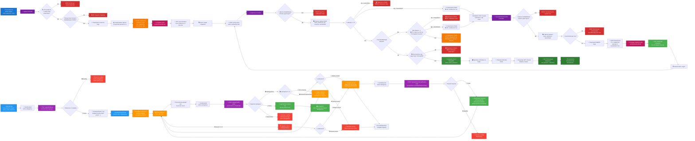

# 📊 Диаграмма процесса регистрации пользователей

> **Полная схема backend + frontend логики регистрации с верификацией email**

```mermaid
flowchart LR
    %% BACKEND - STAGE 1: Registration
    A["👤 Пользователь<br/>POST /signup<br/>email, password, name"] --> B["📝 signup Controller"]
    B --> C{"🔍 Пользователь<br/>с таким email<br/>существует?"}
    C -->|Да| D["❌ 400: Email уже зарегистрирован"]
    C -->|Нет| E{"⏰ Существует процесс<br/>верификации в Redis?"}
    E -->|Да| F["❌ 400: Код уже отправлен"]
    E -->|Нет| G["🔢 Генерация 6-значного кода"]
    G --> H["🔒 Хеширование пароля<br/>bcrypt.hash password, 10"]
    H --> I["💾 Redis сохранение<br/>verification:email<br/>TTL: 2 МИНУТЫ<br/>resendUsed: false"]
    I --> J["📧 Отправка email<br/>sendVerificationEmail"]
    J --> K["✅ 200: Код отправлен<br/>У вас 2 минуты и 3 попытки"]
    K --> L["⏳ Email с кодом отправлен"]
    
    %% BACKEND - STAGE 2: Verification
    L --> M["👤 POST /verify-email<br/>email, verificationCode"]
    M --> N["📝 verifyEmail Controller"]
    N --> O{"💾 Данные верификации<br/>в Redis существуют?"}
    O -->|Нет| P["❌ 400: Код истек<br/>canResend: false"]
    O -->|Да| Q["📊 Парсинг данных Redis<br/>name, password, код, попытки, resendUsed"]
    Q --> R{"🔢 attempts >= 3?"}
    R -->|Да + resendUsed| S["🗑️ Удаление из Redis<br/>❌ 429: canResend: false"]
    R -->|Да + !resendUsed| T["💾 Сохранение в Redis<br/>❌ 429: canResend: true"]
    R -->|Нет| U{"✅ Код верификации верный?"}
    U -->|Нет| V{"📈 attempts + 1<br/>⏱️ TTL сброс на 120 сек<br/>Последняя попытка?"}
    V -->|Да + resendUsed| W["🗑️ Удаление из Redis<br/>❌ 400: canResend: false"]
    V -->|Да + !resendUsed| X["💾 Сохранение в Redis<br/>❌ 400: canResend: true"]
    V -->|Нет| Y["💾 Сохранение в Redis<br/>❌ 400: Неверный код<br/>attemptsLeft + новые 2 минуты"]
    U -->|Да| Z{"🔍 Пользователь уже<br/>существует в MongoDB?"}
    Z -->|Да| AA["🗑️ Удаление из Redis<br/>❌ 400: Email уже существует"]
    Z -->|Нет| BB["👤 Создание User в MongoDB<br/>name, email, password"]
    BB --> CC["🗑️ Удаление verification из Redis"]
    CC --> DD["🎉 Отправка Welcome Email"]
    DD --> EE["🔐 Генерация JWT токенов<br/>httpOnly cookies"]
    EE --> FF["✅ 200: Регистрация завершена<br/>user данные + автовход"]
    FF --> GG["🎉 Пользователь автоматически<br/>авторизован"]
    
    %% BACKEND - STAGE 3: Resend Code (новое!)
    T --> HH["📧 RESEND: POST /resend-verification-code<br/>email"]
    X --> HH
    HH --> II["📝 resendVerificationCode Controller"]
    II --> JJ{"💾 Данные верификации<br/>в Redis существуют?"}
    JJ -->|Нет| KK["❌ 400: Сессия истекла<br/>expired: true"]
    JJ -->|Да| LL["📊 Парсинг данных<br/>name, password, resendUsed"]
    LL --> MM{"🔄 resendUsed уже true?"}
    MM -->|Да| NN["❌ 400: Resend уже использован<br/>resendAlreadyUsed: true"]
    MM -->|Нет| OO["🔢 Генерация НОВОГО кода"]
    OO --> PP["💾 Redis обновление<br/>TTL: 2 МИНУТЫ<br/>attempts: 0<br/>resendUsed: true"]
    PP --> QQ["📧 Отправка НОВОГО кода<br/>sendVerificationEmail"]
    QQ --> RR["✅ 200: Новый код отправлен<br/>Это последняя попытка"]
    RR --> SS["⏳ Новый email с кодом"]
    SS --> M

    %% FRONTEND - STAGE 1: Registration Page
    FE_A["📱 SignUpPage<br/>Пользователь вводит:<br/>name, email, password"] --> FE_B["🔄 handleSubmit<br/>setIsLoading(true)"]
    FE_B --> FE_C["📡 POST /api/auth/signup<br/>useUserStore.signup()"]
    FE_C --> FE_D{"🤔 Response от сервера"}
    FE_D -->|❌ Ошибка| FE_E["🚨 Показать ошибку<br/>setIsLoading(false)<br/>setError(message)"]
    FE_D -->|✅ Успех| FE_F["✅ needsVerification: true<br/>navigate('/verify-email?email=...')"]
    
    %% FRONTEND - STAGE 2: Verification Page
    FE_F --> FE_G["📧 EmailVerificationPage<br/>email из URL параметров"]
    FE_G --> FE_H["⏰ useEffect: startTimer<br/>setTimeLeft(120)<br/>setCanResend(true)"]
    FE_H --> FE_I["⏱️ Timer работает<br/>120...119...118..."]
    FE_I --> FE_J["👤 Пользователь вводит код<br/>6-значное число"]
    FE_J --> FE_K["🔄 handleSubmit<br/>setIsLoading(true)"]
    FE_K --> FE_L["📡 POST /api/auth/verify-email<br/>useUserStore.verifyEmail()"]
    FE_L --> FE_M{"🤔 Response проверки"}
    
    %% FRONTEND - Wrong Code Branch
    FE_M -->|❌ Неверный код| FE_N{"📊 attemptsLeft > 0?"}
    FE_N -->|✅ Есть попытки| FE_O["🔄 Сброс таймера<br/>setTimeLeft(120)<br/>'Залишилось спроб: X'"]
    FE_N -->|❌ Попытки закончились| FE_P{"🔄 canResend?"}
    FE_P -->|✅ Можно resend| FE_Q["🔴 Показать кнопки:<br/>'Надіслати код ще раз'<br/>'Зареєструватися знову'"]
    FE_P -->|❌ Нельзя resend| FE_R["🔴 Показать кнопку:<br/>'Зареєструватися знову'"]
    
    %% FRONTEND - Time Expired Branch
    FE_I -->|⏰ timeLeft === 0| FE_S["⏳ Время истекло<br/>setIsExpired(true)"]
    FE_S --> FE_T{"🔄 canResend?"}
    FE_T -->|✅ Можно resend| FE_Q
    FE_T -->|❌ Нельзя resend| FE_R
    
    %% FRONTEND - Resend Branch (новое!)
    FE_Q --> FE_U["🔄 handleResend<br/>setIsLoading(true)"]
    FE_U --> FE_V["📡 POST /api/auth/resend-verification-code<br/>useUserStore.resendVerificationCode()"]
    FE_V --> FE_W{"🤔 Resend response"}
    FE_W -->|✅ Успех| FE_X["🎉 Новый код отправлен<br/>setTimeLeft(120)<br/>setCanResend(false)<br/>setAttemptsExceeded(false)"]
    FE_W -->|❌ Ошибка| FE_Y["🚨 Показать ошибку<br/>toast.error()"]
    FE_X --> FE_I
    
    %% FRONTEND - Start Over Branch
    FE_Q --> FE_Z["▶️ handleStartOver<br/>navigate('/signup')"]
    FE_R --> FE_Z
    
    %% FRONTEND - Success Branch
    FE_M -->|✅ Успех| FE_AA["🎉 registrationComplete: true<br/>Автовход выполнен"]
    FE_AA --> FE_BB["🏠 navigate('/')<br/>toast.success('Реєстрація завершена!')"]
    
    %% FRONTEND - Return to attempts
    FE_O --> FE_I
    
    %% FRONTEND - Server Error Handling
    FE_M -->|🔥 Server Error| FE_CC["🚨 Показать ошибку<br/>setError(message)<br/>setIsLoading(false)"]

    %% BACKEND STYLES
    style A fill:#1976d2,color:#fff,stroke:#0d47a1,stroke-width:2px
    style B fill:#7b1fa2,color:#fff,stroke:#4a148c,stroke-width:2px
    style N fill:#7b1fa2,color:#fff,stroke:#4a148c,stroke-width:2px
    style II fill:#7b1fa2,color:#fff,stroke:#4a148c,stroke-width:2px
    style BB fill:#388e3c,color:#fff,stroke:#1b5e20,stroke-width:2px
    style I fill:#f57c00,color:#fff,stroke:#e65100,stroke-width:2px
    style J fill:#c2185b,color:#fff,stroke:#880e4f,stroke-width:2px
    style QQ fill:#c2185b,color:#fff,stroke:#880e4f,stroke-width:2px
    style FF fill:#2e7d32,color:#fff,stroke:#1b5e20,stroke-width:3px
    style GG fill:#2e7d32,color:#fff,stroke:#1b5e20,stroke-width:3px
    style RR fill:#4caf50,color:#fff,stroke:#388e3c,stroke-width:2px
    style D fill:#d32f2f,color:#fff,stroke:#b71c1c,stroke-width:2px
    style F fill:#d32f2f,color:#fff,stroke:#b71c1c,stroke-width:2px
    style P fill:#d32f2f,color:#fff,stroke:#b71c1c,stroke-width:2px
    style S fill:#d32f2f,color:#fff,stroke:#b71c1c,stroke-width:2px
    style W fill:#d32f2f,color:#fff,stroke:#b71c1c,stroke-width:2px
    style Y fill:#f57c00,color:#fff,stroke:#e65100,stroke-width:2px
    style AA fill:#d32f2f,color:#fff,stroke:#b71c1c,stroke-width:2px
    style KK fill:#d32f2f,color:#fff,stroke:#b71c1c,stroke-width:2px
    style NN fill:#d32f2f,color:#fff,stroke:#b71c1c,stroke-width:2px
    
    %% FRONTEND STYLES
    style FE_A fill:#2196f3,color:#fff,stroke:#1976d2,stroke-width:2px
    style FE_G fill:#2196f3,color:#fff,stroke:#1976d2,stroke-width:2px
    style FE_H fill:#ff9800,color:#fff,stroke:#f57c00,stroke-width:2px
    style FE_I fill:#ff9800,color:#fff,stroke:#f57c00,stroke-width:2px
    style FE_O fill:#ff9800,color:#fff,stroke:#f57c00,stroke-width:2px
    style FE_X fill:#4caf50,color:#fff,stroke:#388e3c,stroke-width:2px
    style FE_AA fill:#4caf50,color:#fff,stroke:#388e3c,stroke-width:3px
    style FE_BB fill:#4caf50,color:#fff,stroke:#388e3c,stroke-width:3px
    style FE_E fill:#f44336,color:#fff,stroke:#d32f2f,stroke-width:2px
    style FE_Q fill:#ff9800,color:#fff,stroke:#f57c00,stroke-width:2px
    style FE_R fill:#f44336,color:#fff,stroke:#d32f2f,stroke-width:2px
    style FE_S fill:#f44336,color:#fff,stroke:#d32f2f,stroke-width:2px
    style FE_Y fill:#f44336,color:#fff,stroke:#d32f2f,stroke-width:2px
    style FE_CC fill:#f44336,color:#fff,stroke:#d32f2f,stroke-width:2px
    style FE_C fill:#9c27b0,color:#fff,stroke:#7b1fa2,stroke-width:2px
    style FE_V fill:#9c27b0,color:#fff,stroke:#7b1fa2,stroke-width:2px
    style FE_L fill:#9c27b0,color:#fff,stroke:#7b1fa2,stroke-width:2px
```